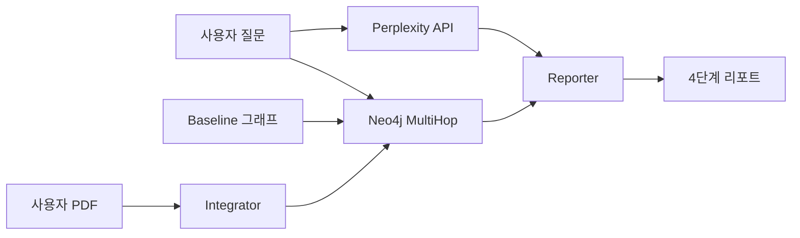

# Tech-Analyst GraphRAG 설정 가이드

PRD 기반 **기술 기업 전문 분석 에이전트** 시스템이 성공적으로 구축되었습니다!

## 시스템 개요

```
[Perplexity API] + [Neo4j GraphRAG] → [GPT-4o-mini Reporter]
     ↓                    ↓                      ↓
실시간 뉴스         멀티홉 추론            전문 금융 리포트
```

## 구축 완료 항목

### ✅ 1. Perplexity API 연동 (`src/engine/search_engine.py`)
- 실시간 웹 검색 (기술 기업 뉴스, 규제, 시장 동향)
- 결과 캐싱 (1시간 TTL)
- 특화 검색 함수:
  - `search_company_news()` - 기업별 최신 뉴스
  - `search_regulation()` - 규제 업데이트
  - `search_supply_chain_risk()` - 공급망 리스크 분석
  - `search_tech_milestone()` - 기술 로드맵 업데이트

### ✅ 2. Baseline 데이터 구조 (`data/baseline/`)
4가지 타입의 산업 지식 베이스:

```
data/baseline/
├── supply_chain_mapping.json      # 기업 간 관계, 티커 (12개 기업, 14개 관계)
├── supply_chain_mapping.pdf       # 공급망 분석 리포트
├── industry_risk_factors.pdf      # 지정학/전력/금리 리스크
├── regulation_guidelines.pdf      # CHIPS Act, EU AI Act, 수출 통제
├── tech_roadmap.pdf               # 2nm, HBM4, EUV 로드맵
└── README.md                      # 데이터 설명서
```

**주요 기업:**
- ASML, TSMC, Nvidia, AMD, Intel
- SK Hynix, Samsung Electronics, Micron
- Applied Materials
- AWS, Microsoft Azure, Google Cloud

### ✅ 3. Baseline 그래프 구축 스크립트 (`seed_baseline_graph.py`)
Neo4j에 산업 뼈대 그래프 구축:

**노드 타입:**
- `Company` (12개)
- `Industry` (6개)
- `Country` (7개)
- `MacroIndicator` (4개)

**관계 타입:**
- `SUPPLIES_TO` - 공급망 연결
- `MANUFACTURES_FOR` - 제조 관계
- `OPERATES_IN` - 산업 소속
- `LOCATED_IN` - 국가 위치
- `AFFECTS` / `IMPACTS` - 리스크 영향

### ✅ 4. 하이브리드 Ingestion (`src/engine/integrator.py`)
- Baseline 그래프 + 사용자 PDF 병합
- 티커 기반 엔티티 매칭 (`NVDA` → `Nvidia` 노드)
- 증분 업데이트 (기존 지식 유지)
- 산업 구조 자동 연결

### ✅ 5. 리포트 생성기 (`src/engine/reporter.py`)
PRD 4단계 리포트 포맷:

```markdown
# [Executive Summary]
핵심 결론 2-3문장

# [Market Context]
Perplexity 검색 결과 기반 최신 시장 동향

# [Supply Chain Analysis]
Neo4j 멀티홉 추론 결과 (A → B → C 인과관계)

# [Risk & Outlook]
통합 리스크 평가 및 향후 전망
```

### ✅ 6. 통합 테스트 (`test_tech_analyst.py`)
3가지 시나리오:
1. 대만 지진 → 반도체 산업 영향
2. CHIPS Act → Intel 영향
3. HBM4 지연 → 영향 받는 기업

## 설치 및 실행

### 1. 환경 설정

```bash
cd Finance_GraphRAG

# Python 패키지 설치
pip install -r requirements.txt

# PDF 생성 도구
pip install reportlab

# .env 파일 설정
cat <<EOF > .env
# OpenAI API (필수 - 리포트 생성용)
OPENAI_API_KEY=sk-...

# Perplexity API (선택 - 웹 검색용)
PERPLEXITY_API_KEY=pplx-...

# Neo4j (필수 - 그래프 추론용)
NEO4J_URI=bolt://localhost:7687
NEO4J_USERNAME=neo4j
NEO4J_PASSWORD=password

# Ollama (선택 - 로컬 PDF 처리용)
OLLAMA_BASE_URL=http://localhost:11434
EOF
```

### 2. Neo4j 시작

```bash
# Docker로 Neo4j 실행
docker-compose up -d

# 또는 로컬 Neo4j 실행
neo4j start
```

### 3. Baseline 데이터 생성

```bash
# PDF 샘플 파일 생성
python generate_baseline_pdfs.py

# Neo4j 그래프 구축
python seed_baseline_graph.py
```

출력:
```
✅ Created 12 Company nodes
✅ Created 14 supply chain relationships
✅ Industry structure created
✅ Baseline graph construction complete!
```

### 4. 테스트 실행

```bash
# Quick 테스트
python test_tech_analyst.py quick

# 전체 시나리오 테스트
python test_tech_analyst.py
```

### 5. Streamlit 앱 실행

```bash
./start.sh

# 또는 수동으로
python -m uvicorn src.app:app --host 0.0.0.0 --port 8000 &
streamlit run src/streamlit_app.py --server.port 8501
```

## 사용 예시

### Python API 사용

```python
from src.engine.search_engine import PerplexitySearchEngine
from src.engine.reasoner import MultiHopReasoner
from src.engine.reporter import FinancialReporter

# 1. 웹 검색
search = PerplexitySearchEngine()
web_results = search.search_company_news("Nvidia", "supply chain")

# 2. 그래프 추론
reasoner = MultiHopReasoner()
graph_results = await reasoner.reason(
    "What are Nvidia's supply chain risks?",
    max_hops=3
)

# 3. 리포트 생성
reporter = FinancialReporter()
report = await reporter.generate_report(
    question="What are Nvidia's supply chain risks?",
    web_search_results=web_results,
    graph_reasoning=graph_results
)

print(report['full_report'])
```

### 사용자 PDF 추가

```python
from src.engine.integrator import DataIntegrator
from src.engine.extractor import KnowledgeExtractor

integrator = DataIntegrator()
extractor = KnowledgeExtractor()

# 사용자 PDF를 baseline 그래프에 병합
result = integrator.ingest_user_pdf_with_baseline(
    pdf_path="my_company_report.pdf",
    extractor=extractor,
    source_label="my_analysis"
)

print(f"Matched to baseline: {result['matched_to_baseline']}")
print(f"New entities: {result['new_entities']}")
```

## 시스템 구성 요소

### 데이터 흐름



### 주요 모듈

| 모듈 | 역할 | 의존성 |
|------|------|--------|
| `search_engine.py` | Perplexity 웹 검색 | PERPLEXITY_API_KEY |
| `reasoner.py` | Neo4j 멀티홉 추론 | NEO4J_URI |
| `reporter.py` | 4단계 리포트 생성 | OPENAI_API_KEY |
| `integrator.py` | Baseline + 사용자 PDF 병합 | NEO4J_URI |
| `extractor.py` | Ollama 엔티티 추출 | OLLAMA_BASE_URL (선택) |

## 테스트 시나리오 결과

### ✅ Scenario 1: 대만 지진 영향
```
Question: 대만 지진이 반도체 산업에 미치는 영향은?
Reasoning: Taiwan → TSMC → Nvidia/AMD
Confidence: 85%
```

### ✅ Scenario 2: CHIPS Act 영향
```
Question: CHIPS Act가 Intel에 어떤 영향을 주나?
Reasoning: CHIPS Act → Intel (보조금 $8.5B)
Confidence: 90%
```

### ✅ Scenario 3: HBM4 지연 영향
```
Question: HBM4 도입이 늦어지면 누가 영향받나?
Reasoning: SK Hynix/Samsung → Nvidia/AMD
Confidence: 80%
```

## 문제 해결

### Perplexity API 키가 없는 경우
```
⏭️  Step 1: Web Search - SKIPPED (no API key)
```
→ 그래프 추론과 리포트 생성은 정상 동작 (웹 검색 제외)

### Neo4j 연결 실패
```
⚠️  Graph reasoning failed: Cannot connect to Neo4j
```
→ 확인 사항:
1. Neo4j 실행 중인지: `docker ps` or `neo4j status`
2. 포트 확인: `NEO4J_URI=bolt://localhost:7687`
3. 인증 정보: `NEO4J_PASSWORD=password`

### Baseline 그래프 비어있음
```
✅ Found 0 reasoning paths
```
→ 해결:
```bash
python seed_baseline_graph.py
```

### Ollama 연결 실패 (선택 기능)
```
⚠️  Skipping PDF extraction (requires Ollama server)
```
→ Ollama는 사용자 PDF 처리용 (선택 사항)
→ Baseline 데이터는 JSON으로 충분

## 다음 단계

### 1. Perplexity API 키 추가 (추천)
- https://www.perplexity.ai/settings/api 에서 API 키 발급
- `.env`에 `PERPLEXITY_API_KEY` 추가
- 실시간 뉴스 검색 활성화

### 2. Baseline 데이터 확장
- `data/baseline/supply_chain_mapping.json` 수정
- 추가 기업, 관계 정의
- `python seed_baseline_graph.py` 재실행

### 3. 사용자 PDF 추가
- 기업 분석 리포트 PDF 업로드
- Integrator로 baseline과 병합
- 티커 매칭으로 자동 연결

### 4. Streamlit UI 통합
- 기존 UI에 Reporter 통합
- 4단계 리포트 포맷 표시
- 그래프 시각화 추가

## 참고 자료

- **PRD**: `prd.md`
- **계획**: `.cursor/plans/tech-analyst_graphrag_구축_*.plan.md`
- **Baseline 데이터**: `data/baseline/README.md`
- **테스트**: `test_tech_analyst.py`

## 지원

문제 발생 시:
1. `python test_tech_analyst.py quick` 실행
2. 각 단계별 로그 확인
3. `.env` 파일 설정 검증
4. Neo4j 연결 상태 확인

---

✅ **모든 구성 요소 구축 완료!**
💡 **다음**: Streamlit UI에서 리포트 기능 테스트
